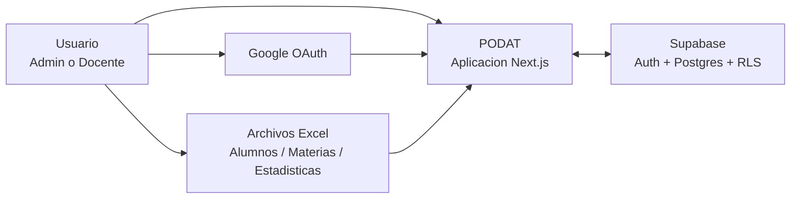
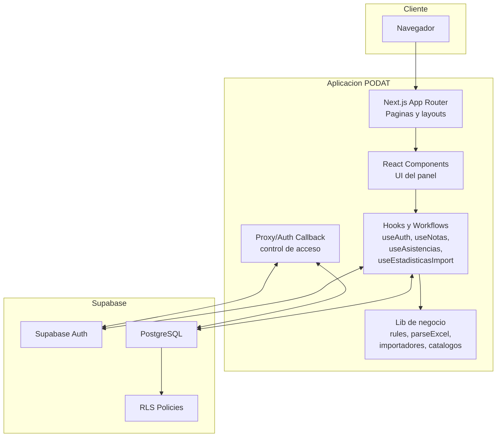
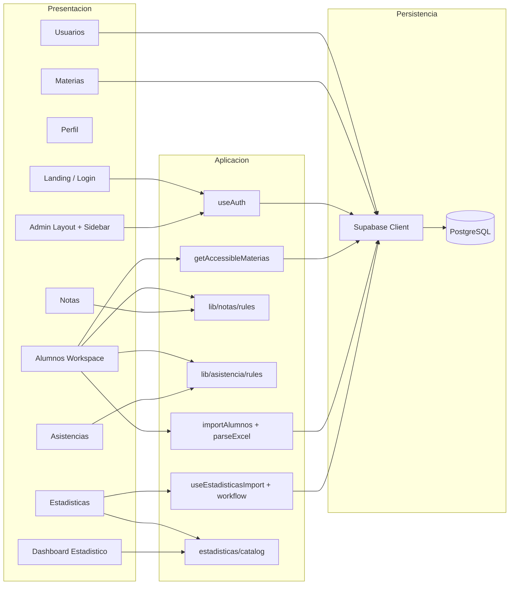
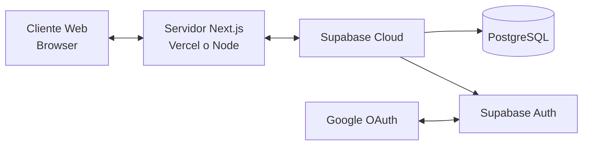
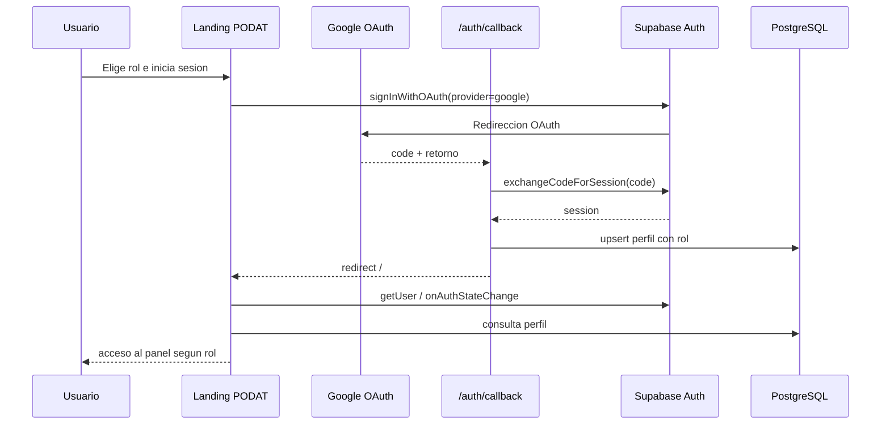
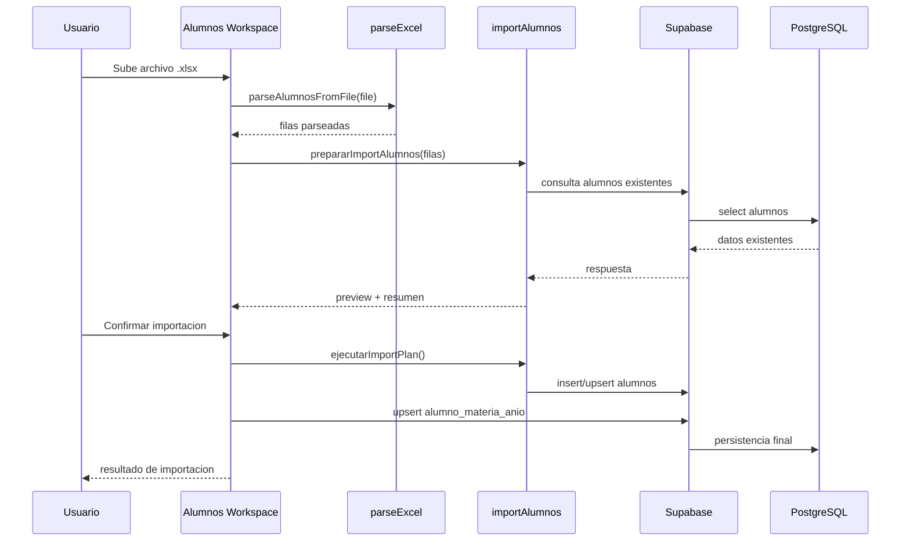
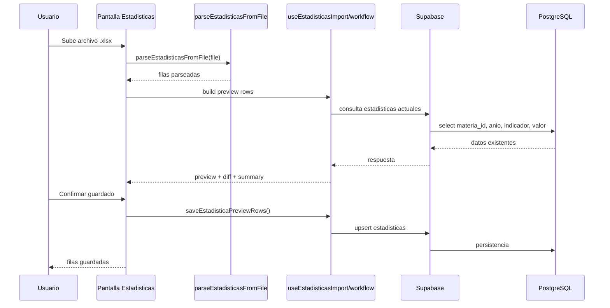
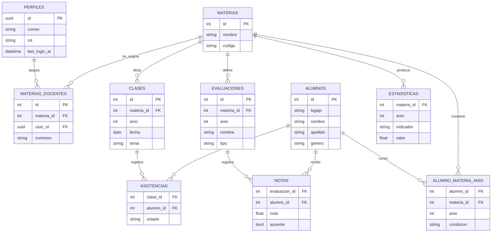

# Arquitectura de Software - PODAT

## 1. Objetivo

PODAT es una plataforma academica web para gestionar:

- autenticacion y perfiles por rol
- materias y asignaciones docentes
- padron de alumnos por materia y ano
- carga de notas
- carga de asistencias
- importacion de estadisticas academicas desde Excel
- dashboards y visualizacion de indicadores

La arquitectura actual esta basada en una aplicacion web monolitica de frontend y backend apoyada en Supabase como BaaS.

## 2. Estilo Arquitectonico

La solucion implementa una arquitectura web por capas, con estos bloques principales:

- Capa de presentacion: Next.js App Router, componentes React, hooks y vistas de panel.
- Capa de logica de negocio: reglas en `lib/`, hooks de workflows, parseadores e importadores.
- Capa de acceso a datos: cliente Supabase desde frontend y callback servidor.
- Capa de persistencia: PostgreSQL en Supabase con tablas, relaciones y RLS.

Patrones que se observan en el sistema:

- SPA/SSR hibrido con Next.js
- BFF liviano para auth callback y proxy
- logica de negocio encapsulada en hooks y modulos `lib/*`
- integracion BaaS con Supabase

## 3. Stack Tecnologico

- Frontend: Next.js 16, React 19, TypeScript
- UI: Tailwind CSS 4
- Auth y DB: Supabase Auth + PostgreSQL
- Importacion Excel: ExcelJS
- Graficos: Chart.js + react-chartjs-2
- Testing: Vitest

## 4. Diagrama de Contexto

## 5. Diagrama de Contenedores

## 6. Diagrama de Componentes Logicos

## 7. Diagrama de Despliegue

## 8. Diagrama de Secuencia - Autenticacion

## 9. Diagrama de Secuencia - Importacion de Alumnos

## 10. Diagrama de Secuencia - Importacion de Estadisticas

## 11. Diagrama Entidad-Relacion

El siguiente modelo ER representa las entidades que se observan en el codigo y en los scripts SQL del proyecto.

## 12. Modulos Funcionales

### 12.1 Autenticacion y perfiles

- login con Google
- seleccion de rol inicial
- callback servidor
- carga del perfil autenticado
- proteccion de rutas por rol

### 12.2 Materias

- alta manual
- importacion desde Excel
- asignacion a docentes
- consulta de materias accesibles

### 12.3 Alumnos

- importacion masiva
- carga manual
- vinculacion por materia y ano
- previsualizacion antes de guardar

### 12.4 Notas

- carga de lista del curso
- registro de parciales y recuperatorios
- validaciones de rango y ausente
- alertas academicas

### 12.5 Asistencias

- alta de clase
- marcacion por alumno
- recalculo de condicion academica

### 12.6 Estadisticas

- parser multi-formato de Excel
- previsualizacion
- deteccion de cambios
- guardado por upsert
- dashboard por indicadores

## 13. Reglas Arquitectonicas Observadas

- El rol del usuario condiciona la navegacion y el acceso a datos.
- Las materias accesibles se resuelven segun rol y asignaciones.
- La importacion siempre usa previsualizacion antes de persistir.
- Las notas y asistencias trabajan por `materia + ano`.
- Las estadisticas trabajan por `materia + ano + indicador`.
- Los indicadores calculados no se persisten como valor base; se derivan en el dashboard.

## 14. Riesgos y Limitaciones de la Arquitectura Actual

- Gran parte del acceso a datos se realiza desde cliente mediante Supabase.
- Hay logica de negocio distribuida entre paginas, hooks y modulos `lib`.
- Algunos modulos grandes concentran demasiada responsabilidad.
- La historia de migraciones SQL no esta consolidada en una sola narrativa reproducible.

## 15. Diagramas Recomendados para Entrega Academica

Si necesitas una entrega formal de diseno de sistemas, los diagramas mas defendibles con el estado real del proyecto son:

- Diagrama de contexto
- Diagrama de contenedores
- Diagrama de componentes
- Diagrama de despliegue
- Diagrama ER
- Diagrama de secuencia de autenticacion
- Diagrama de secuencia de importacion de alumnos
- Diagrama de secuencia de importacion de estadisticas

## 16. Ubicacion de la Implementacion

Referencias principales del sistema:

- `app/`
- `components/`
- `lib/`
- `supabase/`
- `types/`

